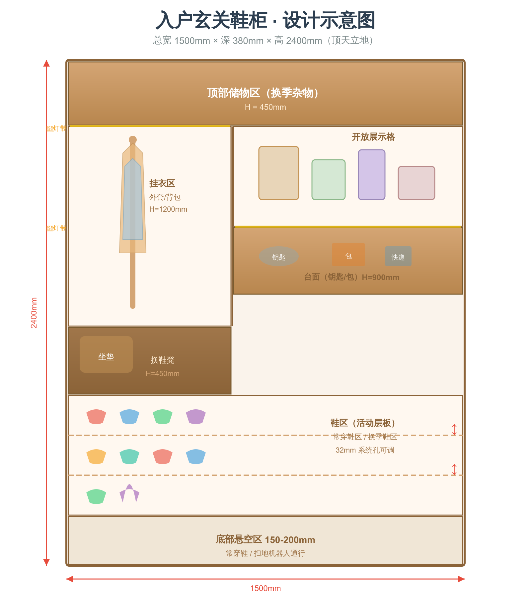
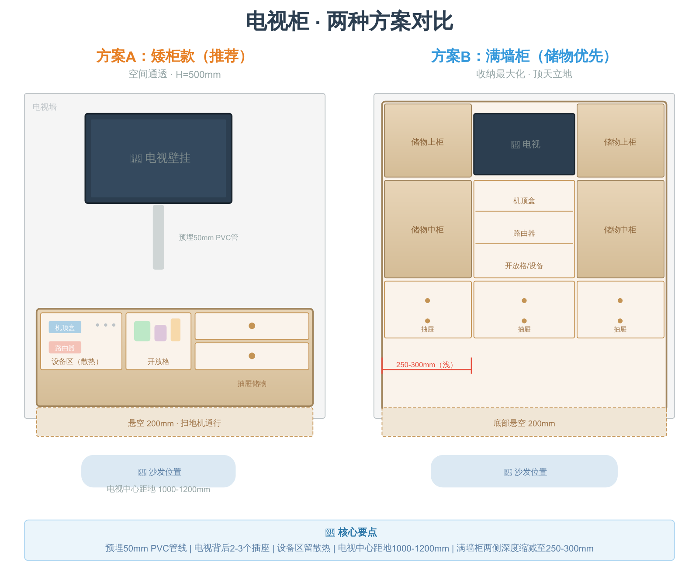
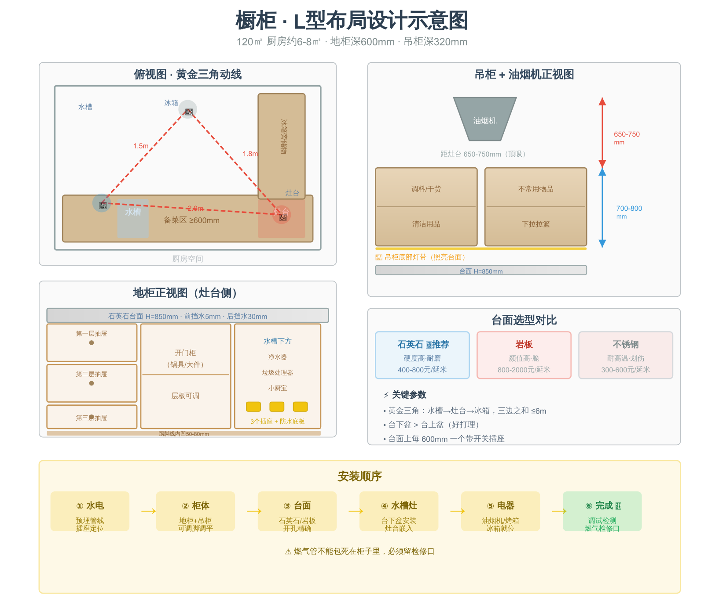
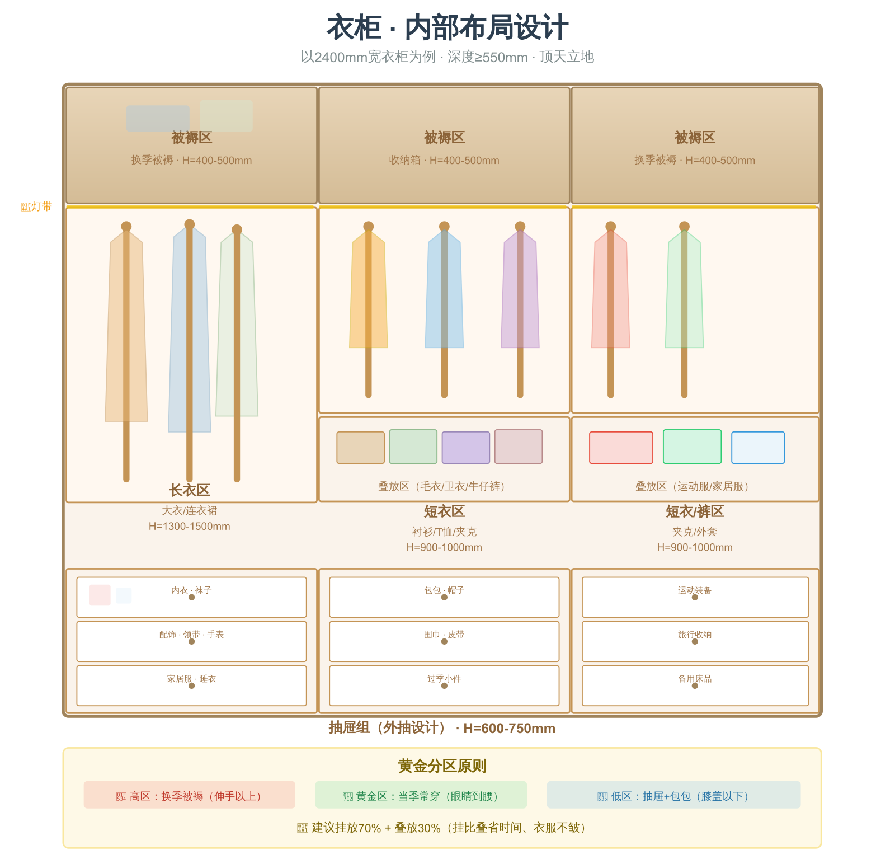
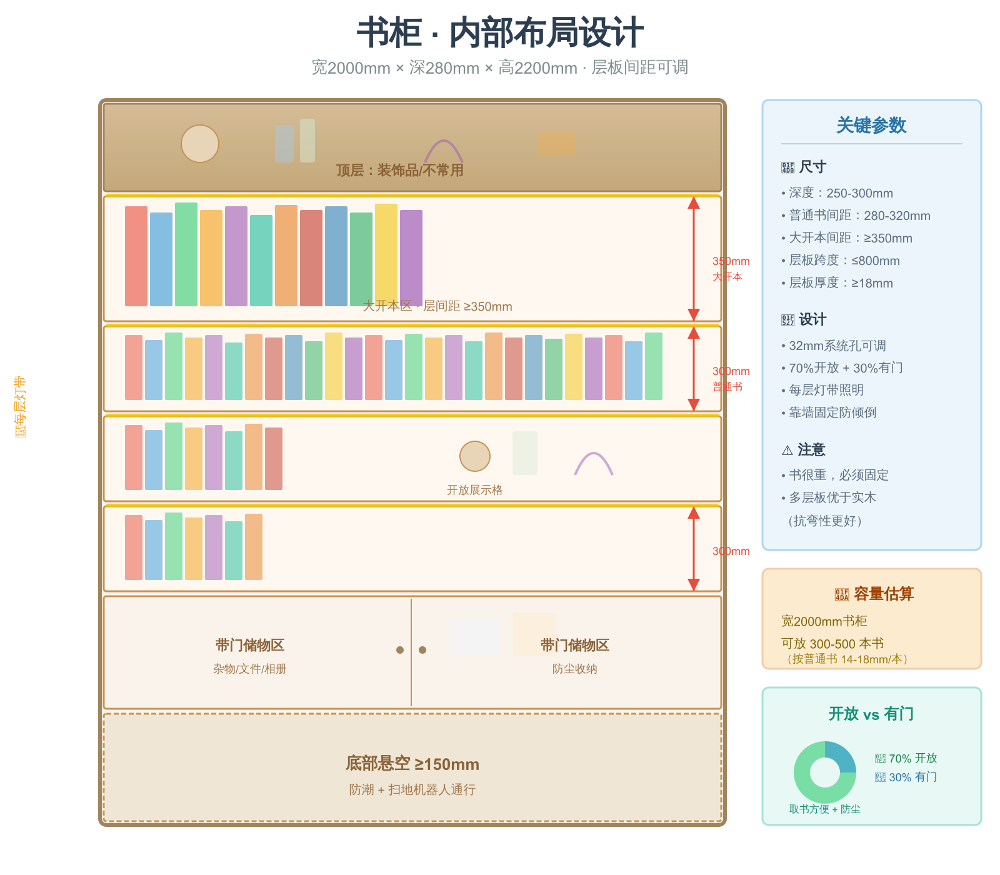
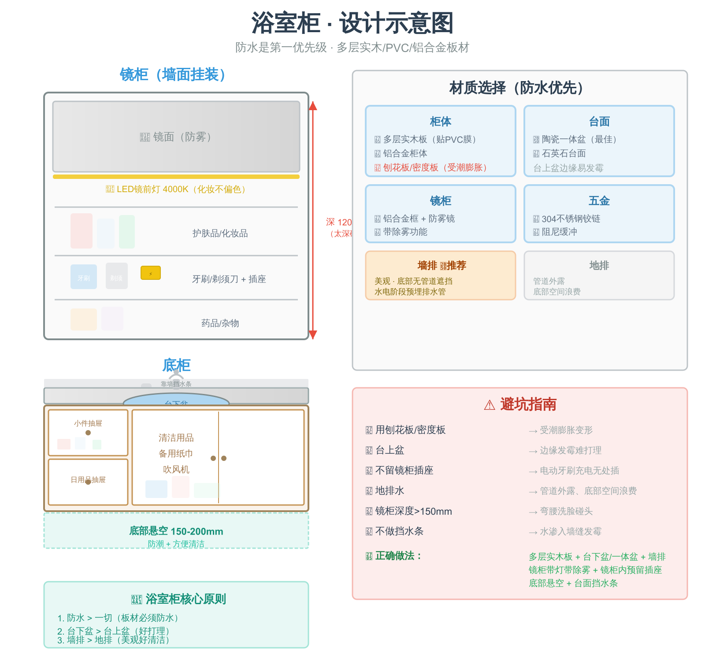

# 柜体设计专项手册（120㎡ 自装修补充）

> 本文为《120㎡ 自装修全流程手册》的补充章节，涵盖 6 大柜体的设计要点。
> 以「自己画图→自己买板材→找工厂/自己切割封边→自己组装」为前提。

---

## 目录

1. [入门柜（玄关鞋柜）](#一入门柜玄关鞋柜)
2. [电视柜](#二电视柜)
3. [橱柜](#三橱柜)
4. [衣柜](#四衣柜)
5. [书柜/书架](#五书柜书架)
6. [浴室柜](#六浴室柜)
7. [通用板材选型](#七通用板材选型)

---

## 一、入门柜（玄关鞋柜）



### 1.1 功能定位

玄关柜 = 鞋柜 + 挂衣区 + 换鞋凳 + 收纳区，是入户第一眼，兼顾实用与美观。

### 1.2 尺寸设计

| 部位 | 推荐尺寸 | 说明 |
|------|----------|------|
| 总高度 | 顶天立地（到吊顶） | 不留顶部积灰空间 |
| 总宽度 | 根据玄关宽度，一般 1200-1800mm | 玄关宽度≥1.2m 时做满墙 |
| 深度 | 350-400mm | 放鞋≥350mm，挂衣≥400mm |
| 换鞋凳高度 | 450mm | 符合人体工学 |
| 换鞋凳宽度 | ≥600mm | 能坐下换鞋 |
| 挂衣区高度 | 1200-1500mm（从换鞋凳面算） | 挂外套、背包 |
| 台面高度 | 900-1000mm | 放包、钥匙 |

### 1.3 内部布局

```
┌──────────────────────────────┐
│     顶部储物区（换季/杂物）     │  高度 400-500mm
├──────────┬───────────────────┤
│ 挂衣区    │  开放展示格/包包区  │  高度 1200-1500mm
│ (挂钩)   │                   │
├──────────┼───────────────────┤
│ 换鞋凳    │   台面（钥匙/包）   │  高度 450mm(凳)/900mm(台)
├──────────┴───────────────────┤
│     鞋区（活动层板）            │  高度 400-500mm
│  常穿鞋区 / 换季鞋区           │
├──────────────────────────────┤
│     底部悬空区                 │  高度 150-200mm
│  （放常穿鞋/扫地机通行）        │
└──────────────────────────────┘
```

### 1.4 设计要点

- **底部悬空 150-200mm**：放日常穿的鞋，不用弯腰开门，扫地机器人可通过
- **鞋区做活动层板**：不同鞋高（高跟鞋 150mm、运动鞋 120mm、靴子 300mm+）灵活调整
- **层板做成可调节**：层板托孔间距 32mm（标准系统孔）
- **中间留开放格**：放钥匙、快递、随手物品
- **预留感应灯带**：顶部或每层底部，开门自动亮
- **挂衣区配挂钩**：S 型挂钩或固定挂钩，挂外套、雨伞、背包
- **预留插座**：烘鞋器、智能感应灯
- **换鞋凳下方可做抽屉**：放鞋垫、鞋油等小物件

### 1.5 注意事项

- 深度≥350mm，否则男士 42 码以上鞋子放不下
- 层板间距不要做死，预留 3-4 排调节孔
- 柜门考虑百叶门或留缝透气，防止鞋子异味闷在里面
- 如果玄关窄（<1.2m），考虑做薄柜（深度 200mm）斜插式层板
- 柜体靠墙固定，防止倾倒

### 1.6 避坑

| 坑 | 后果 | 正确做法 |
|----|------|----------|
| 底部不留悬空 | 每次开门拿鞋麻烦 | 悬空 150-200mm |
| 层板做死 | 高跟鞋/靴子放不下 | 活动层板+调节孔 |
| 没留透气 | 鞋子闷出异味 | 百叶门或柜门留缝 |
| 深度不够 | 鞋子斜放/放不下 | ≥350mm |
| 不留灯带 | 找鞋摸黑 | 预留感应灯带 |

---

## 二、电视柜



### 2.1 功能定位

电视柜 = 电视挂架区 + 影音设备收纳 + 杂物储藏 + 线缆管理。

### 2.2 尺寸设计

| 部位 | 推荐尺寸 | 说明 |
|------|----------|------|
| 总高度 | 400-600mm（矮柜）或顶天立地 | 矮柜显空间大，满墙收纳强 |
| 宽度 | 根据电视墙，一般 2400-3600mm | 120㎡客厅电视墙通常 3-4m |
| 深度 | 350-450mm | 放机顶盒、路由器≥350mm |
| 电视中心高度 | 距地面 1000-1200mm | 坐沙发时视线平齐电视中心 |
| 悬空高度 | 200-300mm（地柜悬空款） | 显轻盈、方便打扫 |

### 2.3 内部布局

**方案 A：矮柜款（推荐，空间通透）**

```
┌────────────────────────────────────────┐
│              电视壁挂区域                │
├──────────┬──────────┬──────────────────┤
│ 设备区   │  开放格   │   抽屉储物区      │
│(机顶盒/  │ (展示/   │   (遥控器/杂物)   │
│ 路由器)  │  装饰品)  │                  │
├──────────┴──────────┴──────────────────┤
│           底部悬空 200mm                │
└────────────────────────────────────────┘
```

**方案 B：顶天立地款（120㎡ 储物优先推荐）**

```
┌──────┬──────────────────┬──────┐
│ 储物 │   电视悬挂区      │ 储物 │
│ 上柜 │  (电视居中)       │ 上柜 │
│      │                  │      │
├──────┤                  ├──────┤
│ 储物 │   开放格/         │ 储物 │
│ 中柜 │   设备区          │ 中柜 │
│      │                  │      │
├──────┴──────────────────┴──────┤
│       地柜（抽屉+开门柜）        │
└────────────────────────────────┘
```

### 2.4 设计要点

- **线缆管理**：预埋 50mm PVC 管（电视到地柜），所有线走管内
- **设备散热**：机顶盒、路由器区域不要做死板，留散热孔或开放格
- **插座规划**：电视背后 2-3 个（电视+Soundbar），地柜内 3-4 个（机顶盒、路由器、游戏机、充电）
- **开放格比例**：30% 开放 + 70% 有门，展示与收纳平衡
- **电视壁挂加固**：挂电视区域的背板用 18mm 板，内部加横撑
- **扫地机通行**：底部悬空≥100mm

### 2.5 注意事项

- 电视中心高度：55 寸电视底边距台面约 700-800mm
- 如果做满墙柜，电视两侧柜体深度可以缩减（250-300mm），减少压迫感
- 柜门考虑无把手设计（反弹器/斜切 45° 拉手），简洁好看
- 预留 HDMI、网线等弱电接口

### 2.6 避坑

| 坑 | 后果 | 正确做法 |
|----|------|----------|
| 不预埋管线 | 线缆外露丑 | 预埋 50PVC 管 |
| 设备区做死板 | 散热不良死机 | 留开放格或散热孔 |
| 电视挂太高 | 看电视仰头累 | 中心离地 1000-1200mm |
| 不留插座 | 插排拉得到处都是 | 电视背后+柜内共 5-7 个 |
| 满墙柜太深 | 客厅压抑 | 两侧深度缩减到 250-300mm |

---

## 三、橱柜



### 3.1 功能定位

橱柜 = 操作台 + 储物 + 嵌入式电器位，厨房核心。

### 3.2 尺寸设计

| 部位 | 推荐尺寸 | 说明 |
|------|----------|------|
| 地柜高度 | 800-850mm（标准）或身高÷2+50mm | 根据身高定制 |
| 地柜深度 | 550-600mm | 标准 600mm |
| 吊柜高度 | 700-800mm（地柜台面到吊柜底部） | 伸手够得到 |
| 吊柜深度 | 300-350mm | 比地柜浅，避免碰头 |
| 吊柜底部离地 | 1500-1600mm | 台面 850 + 间距 700 |
| 台面宽度 | 600mm | 标准 |
| 操作台面长度 | ≥600mm（切菜区） | 洗-切-炒各≥600mm 最佳 |

### 3.3 布局方案（120㎡ 厨房约 6-8㎡）

**一字型**（厨房宽度<1.8m）：
```
冰箱 → 水槽 → 备菜 → 灶台 → 装盘
```

**L 型**（最常见）：
```
       ┌────────┐
       │ 吊柜   │
       │        │
  ┌────┤ 水槽   │
  │    ├────────┤
  │地柜│ 备菜区  │
  │    ├────────┤
  │    │ 灶台   │
  └────┴────────┘
```

**U 型**（厨房宽度≥2.4m）：
```
┌──────────────────┐
│  吊柜             │
├──┬──────────┬───┤
│  │ 水槽     │   │
│地│ 备菜     │地 │
│柜│ 灶台     │柜 │
└──┴──────────┴───┘
```

### 3.4 内部功能分区

**地柜：**
| 区域 | 功能 | 内部配置 |
|------|------|----------|
| 水槽下方 | 净水器、垃圾处理器、小厨宝 | 预留 3 个插座，做防水底板 |
| 灶台下方 | 调料/锅具 | 拉篮或抽屉（三层抽屉最实用） |
| 转角处 | 大件锅具 | 转角拉篮或小怪物拉篮 |
| 冰箱旁 | 储物/干货 | 层板柜 |

**吊柜：**
| 区域 | 功能 | 内部配置 |
|------|------|----------|
| 灶台上方 | 调料/干货 | 层板（注意油烟机位置） |
| 水槽上方 | 清洁用品 | 层板 |
| 其他区域 | 不常用物品 | 层板 + 下拉拉篮（够不到时） |

### 3.5 设计要点

- **黄金三角**：水槽→灶台→冰箱，三边之和≤6m，每边 1.2-2.7m
- **备菜区≥600mm**：太小切菜施展不开
- **台面前后挡水条**：前挡水 5mm（防溢水），后挡水 30-50mm（防渗墙）
- **台下盆**：好打理，水渍直接抹进去（需要台面开孔精确）
- **插座规划**：
  - 台面上方每 600mm 一个（小家电带开关）
  - 水槽下方 3 个（净水器、垃圾处理器、小厨宝）
  - 油烟机 1 个（吊柜内）
  - 冰箱 1 个（独立回路）
  - 烤箱/蒸箱各 1 个（16A）
- **照明**：吊柜底部装灯带（照亮台面，切菜不挡光）
- **踢脚线**：地柜底部踢脚线内凹 50-80mm，站近操作不顶脚

### 3.6 台面选型

| 台面类型 | 优点 | 缺点 | 价格 |
|----------|------|------|------|
| 石英石 | 硬度高、耐磨、不渗色 | 接缝明显 | 400-800 元/延米 |
| 岩板 | 颜值高、耐高温、不渗色 | 脆、容易崩边 | 800-2000 元/延米 |
| 不锈钢 | 耐高温、好打理 | 容易划伤、有噪音 | 300-600 元/延米 |
| 实木 | 质感好 | 怕水、要保养 | 500-1500 元/延米 |

**推荐**：120㎡ 自装建议选 **石英石**（性价比最高），预算充足选岩板。

### 3.7 注意事项

- 地柜要装可调脚（调节水平），不要直接落地
- 水槽柜底部贴防水铝箔纸
- 灶台两侧各留≥300mm 操作台面
- 油烟机与灶台间距：侧吸 350-450mm，顶吸 650-750mm
- 橱柜先装柜体，再装台面，最后装水槽和灶
- 燃气管不能包死在柜子里，要留检修口

### 3.8 避坑

| 坑 | 后果 | 正确做法 |
|----|------|----------|
| 台面上盆 | 水渍抹不进去，发霉 | 做台下盆 |
| 备菜区太小 | 切菜施展不开 | ≥600mm |
| 水槽下不防水 | 漏水泡坏柜体 | 贴防水铝箔+可调脚 |
| 插座不够 | 小家电没地方插 | 台面上每 600mm 一个 |
| 吊柜太高够不到 | 上层沦为摆设 | 底部离地≤1600mm |
| 不留后挡水 | 墙面渗水发霉 | 台面后挡水 30-50mm |
| 柜门没缓冲 | 开关碰撞噪音 | 铰链选阻尼缓冲 |

---

## 四、衣柜



### 4.1 功能定位

衣柜 = 挂衣区 + 叠放区 + 抽屉 + 被褥区，卧室核心收纳。

### 4.2 尺寸设计

| 部位 | 推荐尺寸 | 说明 |
|------|----------|------|
| 总高度 | 顶天立地（到吊顶） | 不留顶部积灰 |
| 深度 | 550-600mm | 挂衣≥550mm（衣架宽度） |
| 长衣区高度 | 1300-1500mm | 大衣、连衣裙 |
| 短衣区高度 | 900-1000mm | 衬衫、T恤、夹克 |
| 抽屉高度 | 200-250mm（单个） | 内衣、袜子、配饰 |
| 被褥区高度 | 400-500mm | 换季被褥 |
| 挂衣杆高度 | 顶部距层板 50-80mm | 留衣架挂钩空间 |

### 4.3 内部布局（以 2400mm 宽衣柜为例）

```
┌────────────────┬──────────────────┬────────────────┐
│                │                  │                │
│   被褥区       │    被褥区         │   被褥区        │  高度 400-500mm
│   (换季)       │    (换季)         │   (换季)        │
├────────────────┼──────────────────┼────────────────┤
│                │                  │                │
│   长衣区       │    短衣区         │   短衣区        │  挂衣区
│  (大衣/裙)     │   (衬衫/T恤)      │   (夹克/裤)     │
│  H=1300-1500   │   H=900-1000     │   H=900-1000   │
│                │                  │                │
│                ├──────────────────┤                │
│                │    叠放区         │   叠放区        │  (短衣区下方)
│                │  (毛衣/卫衣)      │  (牛仔裤折叠)   │
├────────────────┼──────────────────┼────────────────┤
│    抽屉组      │     抽屉组        │    抽屉组       │  高度 600-750mm
│  (内衣/袜子)   │   (配饰/小件)     │   (家居服)      │  (2-3 个抽屉)
└────────────────┴──────────────────┴────────────────┘
```

### 4.4 分区原则

| 区域 | 存放物品 | 配置建议 |
|------|----------|----------|
| 黄金区（眼睛到腰部） | 当季常穿衣物 | 挂衣区 + 频繁取用的叠放 |
| 高区（伸手以上） | 换季被褥、不常用物品 | 被褥区，配收纳箱 |
| 低区（膝盖以下） | 抽屉（内衣袜子）、包包 | 抽屉组或开门柜 |

### 4.5 设计要点

- **挂衣杆**：单杆承重≥30kg，长衣区用单杆，短衣区可上下双杆
- **叠放 vs 挂放比例**：建议 70% 挂 + 30% 叠（挂比叠省时间、衣服不皱）
- **抽屉做外抽**：比内抽方便，不用开门再拉抽屉
- **衣柜深度≥550mm**：标准衣架宽度约 440mm，加上衣服厚度需要≥550mm
- **转角衣柜**：L 型转角处做旋转衣架或贯通式挂杆
- **灯带**：每层挂衣区装感应灯带，找衣服方便
- **裤架**：如果裤子多，可配抽拉式裤架（一个挂 10-15 条）
- **镜子**：柜门内侧贴穿衣镜或做镜面柜门

### 4.6 柜门选择

| 柜门类型 | 优点 | 缺点 | 适用场景 |
|----------|------|------|----------|
| 平开门 | 密封好、全开视野 | 需要开门空间≥600mm | 卧室空间充裕 |
| 推拉门 | 节省空间 | 只能开一半 | 卧室空间紧张 |
| 折叠门 | 开启面积大 | 五金贵、轨道易坏 | 宽衣柜 |
| 无门（开放式） | 取用方便 | 积灰 | 衣帽间 |

**120㎡ 推荐**：卧室衣柜用平开门（密封防尘），空间紧张用推拉门。

### 4.7 注意事项

- 衣柜背板用 9mm 板（不用 18mm，省钱且够用）
- 侧板和层板用 18mm 板
- 柜体用三合一连接件组装，不用钉子
- 衣柜与墙面之间用收口条密封
- 如果做通顶衣柜，顶部留 5-10mm 伸缩缝，用石膏线或顶封板收口

### 4.8 避坑

| 坑 | 后果 | 正确做法 |
|----|------|----------|
| 深度<550mm | 衣服斜挂、关不上门 | ≥550mm |
| 全叠放区 | 找衣服翻乱、衣服皱 | 70% 挂 + 30% 叠 |
| 抽屉做内抽 | 要先开门再拉抽屉 | 做外抽 |
| 不留灯带 | 找衣服摸黑 | 感应灯带 |
| 转角死角 | 转角空间浪费 | 旋转衣架或贯通挂杆 |
| 顶部留大缝隙 | 积灰 | 顶天立地+收口条 |

---

## 五、书柜/书架



### 5.1 功能定位

书柜 = 藏书 + 展示 + 办公收纳，书房/客厅的颜值担当。

### 5.2 尺寸设计

| 部位 | 推荐尺寸 | 说明 |
|------|----------|------|
| 总高度 | 2000-2400mm（方便取书）或顶天立地 | 超过 2m 需要梯子 |
| 深度 | 250-300mm | A4 书深度约 230mm，留余量 |
| 层板间距 | 280-320mm（普通书）| 大开本画册≥350mm |
| 层板厚度 | ≥18mm | 跨度>600mm 用 25mm 或加中间支撑 |
| 底层高度 | ≥150mm | 防潮+扫地机 |

### 5.3 内部布局

```
┌─────────────────────────────┐
│   顶层（不常用/装饰品）       │
├─────────────────────────────┤
│   书籍区（层板间距 300mm）   │
│   ├── 大开本区（350mm）      │
│   └── 普通书区（280mm）      │
├─────────────────────────────┤
│   书籍区 / 开放展示格        │
├─────────────────────────────┤
│   带门储物区（杂物/文件）    │
├─────────────────────────────┤
│   底部悬空（≥150mm）         │
└─────────────────────────────┘
```

### 5.4 设计要点

- **层板承重**：每格宽度≤800mm，否则层板会弯曲
- **层板防倾倒**：跨度大时中间加竖撑或用 25mm 厚板
- **开放 vs 有门比例**：建议 70% 开放（取书方便）+ 30% 有门（防尘）
- **书柜深度 250-300mm** 足够，太深浪费空间
- **预留插座**：书桌区域旁，台灯+电脑充电
- **灯带**：每层顶部装灯带，找书方便、氛围感强
- **如果兼做隔断**：双面可用，深度可做 350-400mm

### 5.5 注意事项

- 实木层板容易弯曲，建议用多层板或刨花板（抗弯性好）
- 书很重，柜体一定要靠墙固定
- 如果有大量大开本画册，层板间距要做 350-400mm
- 开放书架容易积灰，考虑部分带玻璃门

### 5.6 避坑

| 坑 | 后果 | 正确做法 |
|----|------|----------|
| 层板跨度太大 | 书一多就弯 | 跨度≤800mm，或加厚板 |
| 层板间距做死 | 大书放不下 | 预留 32mm 系统孔，活动层板 |
| 全开放 | 积灰严重 | 30% 带门区域 |
| 深度>300mm | 浪费空间 | 250-300mm 足够 |

---

## 六、浴室柜



### 6.1 功能定位

浴室柜 = 洗手盆 + 镜柜 + 底柜储物，卫生间核心。

### 6.2 尺寸设计

| 部位 | 推荐尺寸 | 说明 |
|------|----------|------|
| 台面高度 | 800-850mm | 标准高度 |
| 台面宽度 | 600-1200mm | 根据卫生间宽度 |
| 台面深度 | 500-550mm | 标准 |
| 镜柜高度 | 600-800mm | 含镜子 |
| 镜柜深度 | 120-150mm | 太深碰头 |
| 底柜高度 | 500-550mm（台面高-台面厚） | 含踢脚 |
| 底部悬空 | 150-200mm | 防潮+方便清洁 |

### 6.3 内部布局

**镜柜（墙面挂装）：**
```
┌──────────────────────┐
│  镜面（外侧）         │
├──────────────────────┤
│  上层：护肤品/化妆品   │  层板间距 150-200mm
│  中层：牙刷/剃须刀    │  预留插座（电动牙刷充电）
│  下层：药品/杂物      │
└──────────────────────┘
```

**底柜：**
```
┌──────────────────────┐
│      台面+台上/台下盆  │
├──────┬───────────────┤
│ 抽屉 │    开门柜      │
│(小件)│  (清洁用品/    │
│      │   备用纸巾)   │
├──────┴───────────────┤
│  底部悬空（防潮）     │
└──────────────────────┘
```

### 6.4 设计要点

- **防水是第一位**：浴室柜板材必须用多层实木板或 PVC 板（不要用刨花板/密度板）
- **台下盆优先**：好打理，台面水渍直接扫入盆中
- **镜柜带灯**：LED 镜前灯（色温 4000K，化妆不偏色）
- **镜柜内预留插座**：电动牙刷、剃须刀、吹风机充电
- **底柜离地**：底部悬空 150-200mm，防潮且方便清洁
- **排水方式**：墙排（美观，底部无管道遮挡）优先于地排
- **挡水条**：台面靠墙做挡水条，防止水渗入墙面

### 6.5 材质选择

| 部位 | 推荐材质 | 说明 |
|------|----------|------|
| 柜体 | 多层实木板（贴 PVC 膜）或铝合金 | 防水防潮 |
| 台面 | 陶瓷一体盆 / 石英石 | 一体盆无接缝，最好打理 |
| 镜柜 | 铝合金框 + 防雾镜 | 防潮不变形 |
| 五金 | 304 不锈钢铰链 | 防锈 |

### 6.6 注意事项

- 卫生间湿度大，普通板材一定扛不住，必须选防水材质
- 镜柜深度≤150mm，太深弯腰洗脸会碰头
- 如果做墙排，水电阶段就要预埋排水管
- 智能镜柜考虑除雾功能

### 6.7 避坑

| 坑 | 后果 | 正确做法 |
|----|------|----------|
| 用刨花板/密度板 | 受潮膨胀变形 | 用多层实木或 PVC 板 |
| 台上盆 | 边缘发霉难打理 | 台下盆或一体盆 |
| 不留镜柜插座 | 电动牙刷充电无处插 | 镜柜内预留 1-2 个 |
| 地排水 | 管道外露、底部空间浪费 | 优先墙排 |
| 镜柜太深 | 弯腰洗脸碰头 | 深度≤150mm |
| 不做挡水条 | 水渗入墙缝发霉 | 台面靠墙挡水 |

---

## 七、通用板材选型

### 7.1 常用板材对比

| 板材 | 优点 | 缺点 | 适用 | 价格 |
|------|------|------|------|------|
| **实木多层板** | 防潮好、握钉力强 | 价格较高 | 橱柜、浴室柜 | 200-400 元/张 |
| **实木颗粒板（刨花板）** | 平整度好、价格低 | 防潮差、握钉力一般 | 衣柜、书柜 | 120-250 元/张 |
| **欧松板（OSB）** | 强度高、环保 | 表面粗糙需饰面 | 柜体基层 | 150-300 元/张 |
| **密度板（MDF）** | 表面光滑、适合做造型 | 不防潮、握钉力差 | 柜门（模压门） | 80-150 元/张 |
| **禾香板** | 零甲醛（MDI 胶） | 价格贵 | 环保要求高 | 250-400 元/张 |
| **实木指接板** | 环保、质感好 | 易变形、价格高 | 开放展示 | 200-500 元/张 |
| **生态板（免漆板）** | 免漆、施工方便 | 质量参差不齐 | 现场打柜 | 150-300 元/张 |

### 7.2 板材与柜体匹配建议

| 柜体 | 推荐板材 | 原因 |
|------|----------|------|
| 橱柜柜体 | 实木多层板 | 防潮、耐油烟 |
| 浴室柜 | 多层实木 / PVC / 铝合金 | 防水是刚需 |
| 衣柜柜体 | 实木颗粒板 / 禾香板 | 平整、够用、性价比高 |
| 衣柜柜门 | 实木颗粒板 + PET 膜 / 模压门 | 颜值高 |
| 书柜 | 实木颗粒板 / 多层板 | 抗弯、承重 |
| 入门柜 | 实木颗粒板 | 经济实用 |
| 电视柜 | 实木颗粒板 / 多层板 | 承重+防潮 |

### 7.3 饰面选择

| 饰面 | 效果 | 耐用性 | 价格 |
|------|------|--------|------|
| 三聚氰胺饰面（免漆板） | 平整、花色多 | 耐磨耐划 | 低 |
| PET 膜 | 哑光/高光，手感好 | 较好 | 中 |
| PVC 膜 | 可做造型 | 一般 | 中 |
| 实木贴皮 | 木质感强 | 怕水怕划 | 中高 |
| 烤漆 | 高光、高级感 | 怕划、易黄变 | 高 |

### 7.4 封边工艺

| 封边类型 | 效果 | 说明 |
|----------|------|------|
| EVA 热熔胶封边 | 基础 | 常见，时间久了可能开胶 |
| PUR 封边 | 较好 | 防水性好，不易开胶 |
| 激光封边 | 最好 | 无缝、美观、价格贵 |

**建议**：厨卫柜体选 PUR 封边，其他区域 EVA 封边够用。

### 7.5 五金选型

| 五金件 | 推荐品牌 | 说明 |
|--------|----------|------|
| 铰链（合页） | 百隆（Blum）、海蒂诗（Hettich）、DTC | 带阻尼缓冲，二段力更佳 |
| 抽屉轨道 | 百隆、海蒂诗、DTC | 三节轨比两节轨顺畅 |
| 反弹器 | 百隆、海蒂诗 | 无把手柜门必备 |
| 气撑 | 气弹簧（上翻门用） | 选品牌货，杂牌支撑力不足 |
| 挂衣杆 | 铝合金圆管 Φ25-30mm | 承重≥30kg |
| 拉手 | 按风格选 | 极简风可选斜切 45° 无把手 |

---

## 附录：120㎡ 柜体预算参考

| 柜体 | 数量（参考） | 材料预算 |
|------|-------------|----------|
| 入门柜 | 1 组（宽 1500mm） | 2000-4000 元 |
| 电视柜 | 1 组（宽 3000mm） | 3000-6000 元 |
| 橱柜 | 地柜+吊柜 4-5 延米 | 5000-12000 元 |
| 衣柜 | 主卧 1 组 + 次卧 1 组 | 4000-8000 元 |
| 书柜 | 1 组（宽 2000mm） | 1500-3000 元 |
| 浴室柜 | 1-2 组 | 1500-4000 元 |
| **柜体材料合计** | | **17000-37000 元** |

> ⚠️ 以上为板材+五金材料费参考，不含台面（橱柜/浴室柜）、电器嵌入、人工费。
> 如果找工厂代工切割封边，加工费约 50-100 元/张板。

---

*最后更新：2026-04-14*
*配合《120㎡ 自装修全流程手册》使用*
